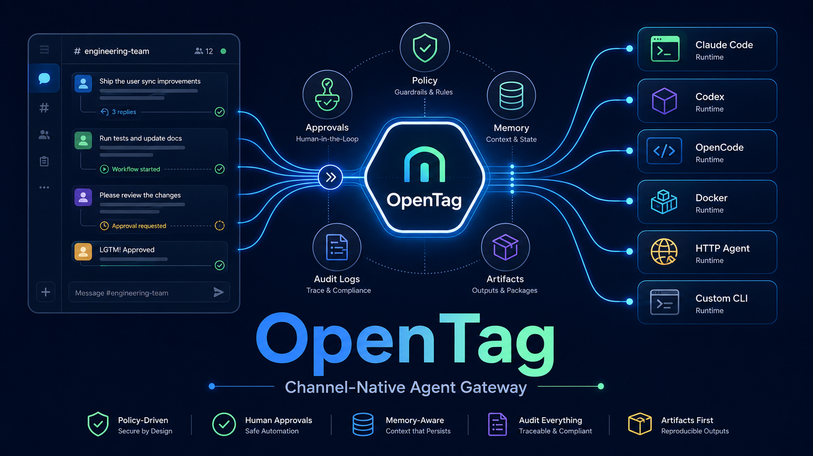

<p align="center">
  
</p>

<h1 align="center">OpenTag</h1>

<p align="center">
  <strong>面向团队频道的开源 Agent Gateway。</strong>
</p>

<p align="center">
  把 AI Agent 带进 Slack thread，并提供共享上下文、审批、审计记录和可插拔 Agent Runtime。
</p>

<p align="center">
  <a href="README.md">English</a> ·
  <a href="README.zh-CN.md">简体中文</a> ·
  <a href="docs/user-guide/README.zh-CN.md">用户指南</a> ·
  <a href="SECURITY.md">安全</a> ·
  <a href="CONTRIBUTING.md">贡献指南</a>
</p>

<p align="center">
  
  
  
  
</p>

OpenTag 把 AI Agent 带到团队已经在使用的协作场景里：Slack channel 和 thread。

相比让某个人在本地终端里运行 Agent、再把结果复制回群里，OpenTag 允许团队直接在 Slack 里 `@OpenTag`，围绕同一个 thread 补充上下文，在需要时审批高风险动作，并让结果对有权限的团队成员持续可见。

---

## ✨ 你可以用它做什么

- 让 Agent 根据 Slack thread 调查 bug。
- 让团队成员在 Agent 运行前或运行中补充上下文。
- 把任务路由到不同 Agent 后端，例如 Codex、Claude Code、OpenCode、Docker Agent、HTTP Agent 或自研 CLI。
- 给不同频道配置不同项目、权限、记忆和默认 Agent。
- 在写操作或高风险动作前要求人工审批。
- 保留 session、决策、输出和 artifact 记录。

OpenTag 适合那些需要上下文、权限和可追溯性的团队 Agent 工作流。

---

## 💬 在 Slack 里怎么用

```text
@OpenTag summarize why this deployment failed

@OpenTag check this thread and draft the fix plan

/runtime codex-readonly explain the current project structure

/opentag sessions
/opentag approvals
/opentag status <session_id>
```

Agent 会回复在同一个 Slack thread 里，工作过程和结果都保留在原始讨论旁边。

---

## 🚀 为什么是 OpenTag

很多 AI 编码和自动化工具默认围绕“一个本地操作者”设计。OpenTag 默认围绕“团队共享频道”设计。

- **默认共享**：对话、上下文和结果留在团队 thread 里。
- **理解频道边界**：每个频道可以有自己的项目、指令、记忆、权限和默认 runtime。
- **不绑定单一 Agent**：可以根据任务选择适合的 Agent 后端。
- **支持审批**：敏感动作可以暂停，等待人工确认。
- **可审计**：session、message、approval、output 和 artifact 可以后续复盘。

---

## ⚡ 快速开始

OpenTag 要求 Node.js `>=20.11.0`。

```bash
git clone https://github.com/linxidnju/OpenTag.git
cd OpenTag
npm install
npm link
opentag init --project . --runtime mock --open-slack
```

初始化后，OpenTag 会生成本地配置、Slack App manifest 和 `.env` 模板。接下来：

1. 在 Slack 后台从 `~/.opentag/slack-app-manifest.yml` 创建 App。
2. 把 Slack token 填入 `~/.opentag/.env`。
3. 运行 `opentag doctor --strict` 检查配置。
4. 运行 `opentag daemon start` 启动本地 daemon。
5. 邀请 bot 进入目标 Slack 频道并开始使用。

完整安装和 Slack 图文配置说明见 [`docs/user-guide/01-install.zh-CN.md`](docs/user-guide/01-install.zh-CN.md)。

## 📦 包含哪些能力

- Slack gateway：支持 mention、thread reply、DM、slash command 和 approval。
- 本地 console 模式：不用 Slack 也能试用 OpenTag。
- Runtime 选择：mock、Codex、Claude Code、OpenCode、Docker、HTTP Agent 和 generic CLI。
- Channel 配置：默认 runtime、可用 runtime、可用用户、审批人、指令、记忆、workspace root。
- 本地记录：sessions、messages、approvals、runs、audit records 和 artifacts。
- Admin 与集成能力：方便团队后续构建更深的工作流。

---

## 📚 用户指南

- [`docs/user-guide/README.zh-CN.md`](docs/user-guide/README.zh-CN.md) - 指南索引
- [`docs/user-guide/01-install.zh-CN.md`](docs/user-guide/01-install.zh-CN.md) - 安装与 Slack 图文配置
- [`docs/user-guide/02-use-in-slack.zh-CN.md`](docs/user-guide/02-use-in-slack.zh-CN.md) - Slack 日常使用
- [`docs/user-guide/03-projects-and-runtimes.zh-CN.md`](docs/user-guide/03-projects-and-runtimes.zh-CN.md) - 项目与 runtime 选择
- [`docs/user-guide/04-admin-and-safety.zh-CN.md`](docs/user-guide/04-admin-and-safety.zh-CN.md) - 审批、安全和运维
- [`docs/user-guide/05-troubleshooting.zh-CN.md`](docs/user-guide/05-troubleshooting.zh-CN.md) - 常见问题排查
- [`docs/user-guide/06-faq.zh-CN.md`](docs/user-guide/06-faq.zh-CN.md) - FAQ

实现细节见 [`docs/developer-guide.zh-CN.md`](docs/developer-guide.zh-CN.md)。

---

## 🔐 安全模型

OpenTag 的目标是让团队里的 Agent 工作可见、可控、可追溯。

- Secret 应通过环境变量提供，不应提交到仓库。
- 频道可以限制谁能使用 OpenTag，以及允许使用哪些 runtime。
- 写权限或高风险动作可以要求审批。
- Workspace 和文件系统根目录可以通过配置限制。
- Run、approval、artifact 和 audit record 会被保留用于复盘。

安全报告和项目安全说明见 [`SECURITY.md`](SECURITY.md)。

---

## 🧭 当前状态

OpenTag 当前是面向 Slack-first 团队 Agent 工作流的 MVP，适合本地试用、内部团队实验和 runtime 集成。

它还不是托管型生产 SaaS。后续计划包括 Slack OAuth 安装、更强的多实例存储、Web Admin UI、沙盒加固，以及更多频道集成。

---

## 📄 License

Apache-2.0. See [`LICENSE`](LICENSE).
