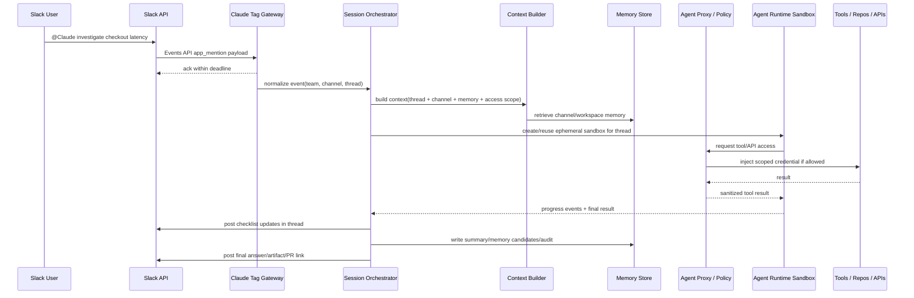

# 00. Claude Tag 实现方式分析

> 目标：从公开资料反推 Claude Tag 的系统设计，并转化成 OpenTag 的开源实现方案。这里不是泄露内部实现，而是基于官方文档、公开发布信息和 Slack/Agent 生态的可实现推断。

## 1. Claude Tag 到底是什么

Claude Tag 是 Anthropic 把 Claude 变成 Slack 中“可被团队 @ 的共享工作伙伴”的产品。公开信息显示，它从 Slack 开始，Team / Enterprise beta 可用。用户在频道或 thread 中 `@Claude`，Claude 会读取相关上下文、拆解任务、在后端工作环境中执行，并把结果回到 Slack thread。

它与传统 Slack bot 的关键差异：

| 能力 | 普通 Slack bot | Claude Tag |
|---|---|---|
| 身份 | 一个 bot，但通常代表某个服务 | 组织级共享 Agent 身份，使用管理员配置的服务账号 |
| 任务空间 | 单次消息回复 | 每个 Slack thread 是一个工作 session |
| 可见性 | bot 回复可见，但过程通常不可见 | 过程、checklist、结果都在 thread 中可见 |
| 权限 | 通常是 bot token 或个人 OAuth | access bundle / scope / service account |
| 记忆 | 通常无，或全局 bot 记忆 | 频道/工作区记忆，公共频道可形成 workspace memory，私有频道单独保存 |
| 工作环境 | 通常 API 调 LLM | ephemeral sandbox，可读文件、运行代码、生成文件、开 PR |
| 异步 | 弱 | 长任务、计划任务、静默后重建 sandbox |
| 治理 | 弱 | 预算、审计、权限、连接器、工具范围 |

## 2. 公开信息中的关键设计信号

### 2.1 频道级共享 Agent

Claude Tag 的官方描述是“在给定 Slack channel 内有一个 Claude 与所有人交互”，任何频道成员都能看到它在做什么，并接着前一个人的对话继续推进。这说明 Claude Tag 的最小协作单元不是 user，而是 **channel + thread**。

OpenTag 对应设计：

```text
Workspace
  └── Channel Scope
        ├── Agent Identity
        ├── Access Bundle
        ├── Channel Memory
        └── Thread Sessions
              ├── Slack thread_ts
              ├── Agent runtime session id
              ├── Task state / checklist
              └── Audit log
```

### 2.2 每个 thread 一个 session

公开文档说明：用户 `@Claude` 后，该 thread 启动一个 working session。thread 中其他人无需再次 @，可以继续 steer。长任务期间 Claude 通过 checklist 表示进度，最终结果回到 thread。

OpenTag 对应实现：

- Slack event 中抽取 `team_id`、`channel_id`、`thread_ts`。
- 如果无 `thread_ts`，用消息自己的 `ts` 作为 root thread。
- `thread_ts` 是会话路由键。
- 同一 thread 的后续 `message.channels` / `message.groups` / `message.im` 事件，如果 session 处于 active / awaiting_user / recently_active，就进入同一 Agent session。
- 所有回复写入同一 Slack thread，而不是新开频道消息。

### 2.3 ephemeral sandbox + 持久 thread

Claude Tag 文档描述：任务开始时为 thread 创建隔离工作环境；工作结束或 idle 后释放 sandbox；Slack thread、会话上下文、channel memory、外部系统中的 PR/文件会保留；只存在 sandbox 内的文件不会持久化。

OpenTag 对应实现：

第一版可以先不做强沙盒，先做 `workspace checkout + worker process`，但接口上必须提前抽象：

```text
SessionOrchestrator
  -> RuntimeWorkspaceProvider
      -> local checkout / docker container / firecracker microVM / remote VM
  -> AgentRuntimeAdapter
  -> ArtifactPersister
```

否则后面很难加安全边界。

### 2.4 Agent 身份与访问范围按 channel/scope 走

Claude Tag 在 channel 中不是“替某个用户工作”，而是使用管理员配置的服务账号和 access bundle。DM 则不同，DM 使用个人 Claude 账号/个人连接器。

OpenTag MVP 建议：

- MVP 先只做 channel 模式，不做个人 DM 复杂权限。
- 每个 channel 绑定一个 `agent_identity_id`。
- 每个 identity 绑定一个或多个 `connection`，例如 GitHub App installation、Linear token、Jira token、Sentry token、Datadog token、内部 API key。
- 禁止直接把密钥注入 LLM prompt；后续用 Agent Proxy 注入。

### 2.5 Access Bundle 是核心抽象

Claude Tag 使用 Access bundle 表示一组连接、仓库权限、插件、规则、指令，并附着到 scope。OpenTag 也应该复制这个抽象。

```yaml
access_bundle:
  name: platform-engineering
  scopes:
    - slack:T123:C456
  repositories:
    - github:reverie-ai/backend
    - github:reverie-ai/web
  tools:
    - github.read
    - github.pull_request.write
    - linear.read
    - sentry.read
  instructions:
    - docs/team-conventions.md
  policy:
    require_approval_for:
      - shell:dangerous
      - github:merge_pr
      - deploy:* 
```

### 2.6 记忆不是“用户画像”，而是“地方记忆”

Claude Tag 的关键创新是 memory follows places。公共频道的记忆可作为 workspace memory 被其他频道引用；私有频道写入自己的私有存储。

OpenTag 可分三层实现：

1. **Thread Memory**：当前 thread 的消息、summary、任务状态。
2. **Channel Memory**：该频道的事实、约定、项目状态。
3. **Workspace Public Memory**：来自公开频道、可跨频道检索的组织知识。

第一版可以只做 1 和 2；第二版做 3。

### 2.7 “ambient behavior” 是 watcher + scheduler + policy

Claude Tag 可以主动 flag 信息、追踪沉默线程、按计划执行任务。这并不是“模型自己醒来”，而是后端有事件源和调度器：

- Slack channel watcher：监听频道中未 @ 的消息，按规则判断是否要提醒。
- Thread watcher：检查 active thread 是否超时、是否等待某人审批。
- Scheduled routine：定时 digest、日报、站会总结。
- External webhook：GitHub PR、Sentry alert、Datadog monitor、Linear issue 更新。

OpenTag 不应在 MVP 做全量 ambient，否则容易权限和成本失控。建议先做 `/opentag routine add` 的显式定时任务。

## 3. Claude Tag 可能的端到端链路



## 4. 技术实现拆解

### 4.1 Slack Ingress

负责：

- 接收 Slack Events API / Socket Mode payload。
- 校验签名、去重、ack。
- 解析 `app_mention`、thread reply、DM、slash command、interactive button。
- 转换为 OpenTag 标准事件 `OpenTagMessageEvent`。

MVP 建议：

- 自托管/开发环境用 Socket Mode，省去公网 webhook。
- SaaS / Marketplace 版本用 HTTP Events API，因为 Slack Socket Mode app 不适合公开 Marketplace 分发。

### 4.2 Scope Resolver

输入：`workspace_id + channel_id + user_id + thread_ts`

输出：

- 当前 channel 是否启用 OpenTag。
- 当前用户是否允许触发。
- 绑定哪个 Agent identity / access bundle / runtime。
- 是否需要人工审批。

### 4.3 Session Orchestrator

核心职责：

- 以 `workspace_id + channel_id + thread_ts` 找 session。
- session 不存在则创建。
- session active 时把新 thread reply 作为 interrupt / steer 消息发送给 runtime。
- runtime 空闲或结束后归档。
- 管理状态机。

状态机：

```text
new -> queued -> context_building -> running -> awaiting_user -> running -> completed
                         |              |               |
                         v              v               v
                       failed        cancelled         timed_out
```

### 4.4 Context Builder

上下文不是简单拼 Slack 消息。建议分层：

1. Trigger message：用户当前要求。
2. Thread context：root + recent replies + summary。
3. Channel context：topic、pins、近期相关消息、频道记忆。
4. Project context：repo/AGENTS.md/CLAUDE.md/README/issue。
5. Access context：可用工具列表、限制、审批规则。
6. System instructions：OpenTag 行为规范。

### 4.5 Agent Runtime Adapter

OpenTag 不直接绑定某个 Agent。它只定义统一事件协议：

```ts
interface AgentRuntimeAdapter {
  id: string;
  capabilities(): RuntimeCapabilities;
  start(input: AgentStartInput): AsyncIterable<AgentRuntimeEvent>;
  send(sessionId: string, message: AgentUserMessage): Promise<void>;
  cancel(sessionId: string): Promise<void>;
}
```

### 4.6 Policy Engine

所有高风险动作必须经过 policy：

- 读取私有频道历史。
- 写文件 / commit / push branch / open PR。
- 访问外部 host。
- 使用密钥调用 API。
- 执行 shell 命令。
- 发送消息到其它频道。
- 创建/修改 ticket。

Policy 结果：

- allow
- deny
- require_human_approval
- allow_with_redaction
- allow_readonly

### 4.7 Audit & Usage

必须保存：

- 谁触发任务。
- 哪个频道、哪个 thread。
- 选用哪个 runtime/model。
- 读取了哪些上下文来源。
- 调用了哪些工具。
- 生成了哪些 artifact。
- 成本、tokens、时长。
- 是否触发审批、谁批准。

## 5. OpenTag 与 Claude Tag 的差距

| 能力 | Claude Tag | OpenTag MVP | OpenTag 后续 |
|---|---|---|---|
| Slack @ mention | 有 | 有 | 有 |
| Thread session | 有 | 有 | 有 |
| Shared identity | 有 | 基础 bot identity | service account / GitHub App |
| Access bundle | 有 | YAML 配置 | Admin UI + secrets store |
| Ephemeral sandbox | 有 | local/docker worker | microVM/remote sandbox |
| Agent Proxy | 有 | 简化 policy + env 注入 | default-deny egress + boundary credential injection |
| Channel memory | 有 | 基础 summary/notes | workspace memory + vector search |
| Ambient behavior | 有 | 暂不做 | routines/watchers |
| Spend limit | 有 | runtime cost log | workspace/channel budgets |
| Admin audit | 有 | DB audit | UI + export |
| 多平台 | 计划扩展 | 先 Slack | Teams/Discord/Telegram |

## 6. 结论

Claude Tag 的本质可以总结为：

> 把团队协作工具中的一个频道，变成一个拥有共享上下文、共享权限、共享记忆、共享审计的 Agent 工作空间。

所以 OpenTag 不能只做 “Slack 消息转发给 Claude Code”。那只是 demo。真正值得开源的 OpenTag 应该是一个 **Channel-native Agent Operating Layer**：

- 频道是权限边界。
- thread 是 session 边界。
- access bundle 是能力边界。
- sandbox 是执行边界。
- policy/audit 是安全边界。
- adapter 是生态边界。
