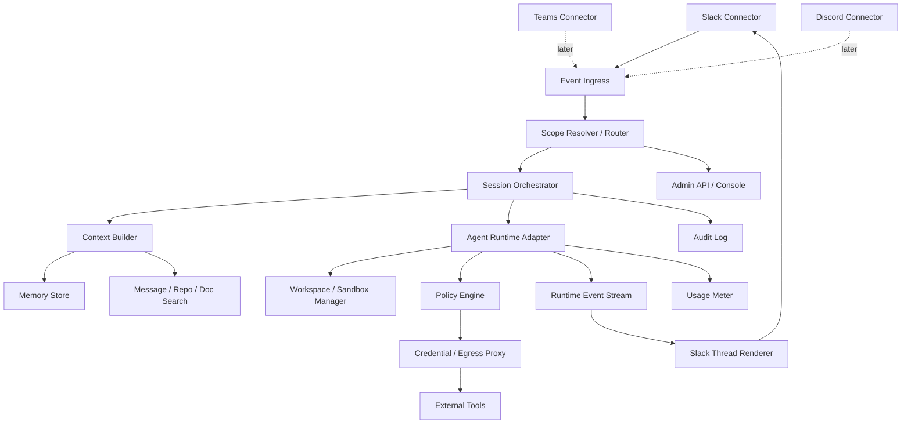

# 02. OpenTag 系统架构

## 1. 总览



## 2. 组件职责

### 2.1 Channel Connectors

不同协作平台的接入层。第一版只做 Slack。

能力：

- 接收消息事件。
- 发送 thread 回复。
- 更新消息/checklist。
- 处理按钮/审批交互。
- 上传文件/图片/报告。
- 拉取 thread 历史、频道信息、pins。

接口：

```ts
interface ChannelConnector {
  platform: 'slack' | 'teams' | 'discord' | string;
  listen(handler: (event: ChannelEvent) => Promise<void>): Promise<void>;
  postMessage(input: PostMessageInput): Promise<MessageRef>;
  updateMessage(input: UpdateMessageInput): Promise<void>;
  fetchThread(ref: ThreadRef): Promise<ChannelMessage[]>;
  fetchChannelContext(ref: ChannelRef): Promise<ChannelContext>;
}
```

### 2.2 Event Ingress

负责把平台事件转为统一事件。

标准事件示例：

```json
{
  "id": "evt_01",
  "platform": "slack",
  "workspace_id": "T123",
  "channel_id": "C456",
  "thread_id": "1710000000.000100",
  "message_id": "1710000000.000200",
  "user_id": "U789",
  "type": "mention",
  "text": "@OpenTag fix the login redirect bug",
  "raw": {}
}
```

必须做：

- 签名校验。
- 去重：Slack retry / duplicate event。
- ack 快速返回。
- 事件落库后异步处理。

### 2.3 Scope Resolver

Scope 是 OpenTag 的权限边界。

Scope 层级：

```text
organization
  workspace
    channel
      thread
```

Resolver 输出：

```json
{
  "scope_id": "scope_platform_eng",
  "agent_identity_id": "agent_platform_eng",
  "access_bundle_id": "bundle_platform_readwrite",
  "runtime_id": "claude-code",
  "policy_profile": "engineering-default",
  "memory_profile": "workspace-public-plus-channel",
  "budget_profile": "eng-500-usd-monthly"
}
```

### 2.4 Session Orchestrator

Session 是 OpenTag 的核心。

职责：

- 创建 session。
- 管理 session 状态。
- 维护 thread -> runtime session 映射。
- 处理新消息 interrupt。
- 调度 worker。
- 处理超时、取消、失败、重试。
- 输出 progress events。

状态：

```text
created
queued
context_building
running
awaiting_approval
awaiting_user
completed
failed
cancelled
timeout
```

### 2.5 Context Builder

输入：当前事件 + scope + session。

输出：给 runtime 的 prompt/context bundle。

上下文结构：

```yaml
system:
  - opentag behavior policy
  - runtime-specific instructions
scope:
  workspace: ReverieAI
  channel: platform-eng
  allowed_tools: [read_repo, create_pr, read_sentry]
thread:
  root: ...
  recent_replies: ...
  summary: ...
memory:
  channel_facts: ...
  workspace_facts: ...
project:
  repo: ...
  docs: ...
user_request:
  text: ...
```

### 2.6 Agent Runtime Adapter

所有 Runtime 输出统一事件：

```ts
type AgentRuntimeEvent =
  | { type: 'started'; runtimeSessionId: string }
  | { type: 'text_delta'; text: string }
  | { type: 'plan_update'; items: ChecklistItem[] }
  | { type: 'tool_call'; tool: string; input: unknown }
  | { type: 'tool_result'; tool: string; output: unknown }
  | { type: 'artifact'; artifact: ArtifactRef }
  | { type: 'approval_request'; request: ApprovalRequest }
  | { type: 'usage'; usage: UsageRecord }
  | { type: 'completed'; result: AgentResult }
  | { type: 'failed'; error: AgentError };
```

### 2.7 Workspace / Sandbox Manager

抽象不同执行环境：

- local process：最快，适合开发。
- Docker container：MVP 推荐。
- remote VM：适合长任务。
- microVM / Firecracker：高安全版本。
- serverless sandbox：按需启动。

接口：

```ts
interface WorkspaceProvider {
  prepare(input: WorkspacePrepareInput): Promise<WorkspaceHandle>;
  cleanup(handle: WorkspaceHandle): Promise<void>;
  persistArtifacts(handle: WorkspaceHandle): Promise<ArtifactRef[]>;
}
```

### 2.8 Policy Engine

所有 runtime 请求工具/命令/网络/文件系统操作都应该经过策略判断。

MVP 可以先做 wrapper：

- 命令 allowlist/denylist。
- repo path 限制。
- env secrets 最小化。
- 人工审批按钮。

后续做 Agent Proxy：

- 出站网络 default-deny。
- host/path/method allowlist。
- credential boundary injection。
- response redaction。

### 2.9 Memory Store

建议组合：

- Postgres：结构化事实、session summary、audit。
- pgvector / Qdrant：语义检索。
- Object storage：artifact。
- Redis：session lock、queue、rate limit。

### 2.10 Renderer

Renderer 把 runtime events 渲染成 Slack thread。

渲染策略：

- started：发一条 “On it” 消息。
- plan_update：更新 checklist，而不是刷屏。
- text_delta：不要每 token 发 Slack；buffer 后定期更新。
- tool_call：默认不展示详情，只展示可读步骤；审计页展示完整。
- approval_request：Slack button。
- completed：最终总结 + artifact/PR 链接。

## 3. 单体优先还是微服务优先

MVP 建议 modular monolith：

```text
apps/server       Fastify/NestJS API + Slack webhook
apps/worker       BullMQ worker
apps/console      Admin UI, later
packages/core     domain model
packages/slack    Slack connector
packages/runtime  runtime adapter interface
packages/policy   policy engine
packages/memory   memory service
```

不要一开始拆微服务。先保证：

- 事件不丢。
- session 不乱。
- runtime 可替换。
- 审计可查。
- 部署简单。

## 4. 推荐技术栈

### 4.1 TypeScript 路线

- Node.js + TypeScript
- Fastify 或 NestJS
- Slack Bolt SDK
- BullMQ + Redis
- Postgres + Prisma/Drizzle
- Docker worker
- OpenTelemetry
- Next.js admin console

优点：Slack/Discord/Teams SDK 生态好，开源贡献门槛低。

### 4.2 Python 路线

- FastAPI
- Celery/RQ/Arq
- SQLAlchemy
- Slack Bolt Python
- Docker SDK

优点：AI/RAG 生态强。

### 4.3 建议

OpenTag Core 用 TypeScript 更适合做网关和多平台 connector；Agent adapter 可以调用 Python 子进程或 MCP server。

## 5. 关键非功能要求

| 要求 | MVP 标准 |
|---|---|
| Slack ack | 3 秒内 ack，后台处理 |
| 事件去重 | event_id 唯一约束 |
| session 并发 | 同 thread 串行，不同 thread 并行 |
| 长任务 | worker 可跑 30 分钟以上，可恢复 |
| 审计 | 每次 tool call / shell / file artifact 必须记录 |
| 成本 | 至少记录 runtime 报告的 tokens/cost 或估算 |
| 安全 | secrets 不进 prompt；危险命令 require approval |
| 可扩展 | 新 Runtime 新 Connector 不改核心 |

## 6. 部署形态

### 6.1 Local self-hosted

适合开发者和小团队：

```text
Docker Compose:
  opentag-server
  opentag-worker
  postgres
  redis
```

Slack 用 Socket Mode，不需要公网。

### 6.2 Team server

适合团队内部：

- HTTPS webhook。
- Postgres managed。
- Redis managed。
- Worker 可横向扩展。
- GitHub App / Slack App 自建。

### 6.3 SaaS

后续才做：

- 多租户隔离。
- Slack OAuth 安装流。
- Billing。
- Marketplace 分发。
- SOC2/合规。

## 7. 架构风险

1. **Runtime 差异太大**：必须用事件协议抽象，不要把 Claude Code 的输出格式写死到核心。
2. **Slack 刷屏**：必须有 renderer debounce 和 message update。
3. **权限失控**：MVP 也要有最小 policy。
4. **长任务丢失**：session 状态必须落库，worker 可重试。
5. **上下文过长**：必须做 thread summary 和 memory retrieval。
6. **用户把它当人类同事**：UI 必须清晰标注 AI 可能出错，需要 review。
