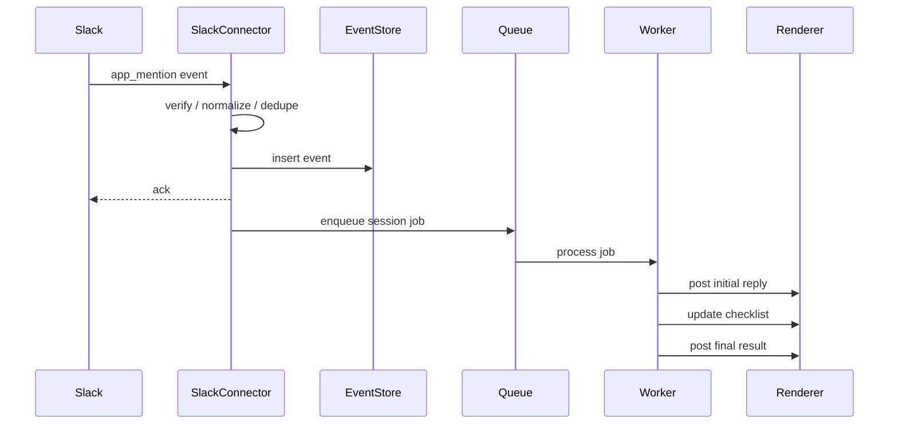

# 03. Slack MVP 设计

## 1. MVP 目标

做出一个可真实使用的 Slack 版 OpenTag：

- 在 Slack channel 中 `@OpenTag` 触发任务。
- OpenTag 在同一个 thread 中回复和更新进度。
- 同 thread 中任何人继续回复，OpenTag 能接收并影响当前任务。
- 根据 channel 路由到指定 repo/project/runtime。
- 任务执行过程和结果可审计。
- 支持基础审批。

## 2. Slack App 事件

MVP 需要订阅：

| Slack 事件 | 用途 |
|---|---|
| `app_mention` | 用户在频道中 @OpenTag 触发新任务或邀请 bot |
| `message.channels` | 公开频道 thread reply，后续 steer |
| `message.groups` | 私有频道 thread reply |
| `message.im` | DM，MVP 可先禁用或只做 help |
| `app_home_opened` | 后续 App Home 配置 |

MVP 交互：

| 交互 | 用途 |
|---|---|
| button approve | 允许高风险动作 |
| button deny | 拒绝高风险动作 |
| button cancel | 取消当前 session |
| slash command `/opentag status` | 查看频道配置 |

## 3. Socket Mode vs HTTP Events API

### 3.1 MVP 推荐 Socket Mode

优点：

- 不需要公网 URL。
- 开发者本机/内网服务器可以直接跑。
- 自托管用户部署简单。

缺点：

- 不适合公开 Slack Marketplace 分发。
- 需要维持 WebSocket 连接。

### 3.2 SaaS 推荐 HTTP Events API

优点：

- 适合多租户。
- 更符合 Marketplace 安装流。
- webhook 可水平扩展。

缺点：

- 需要公网 HTTPS。
- 要处理签名校验、重试、超时。

### 3.3 OpenTag 实现建议

抽象 `SlackTransport`：

```ts
type SlackTransportMode = 'socket_mode' | 'http_events';
```

两种模式输出完全相同的 `ChannelEvent`。

## 4. Slack 事件处理链路



## 5. Thread 规则

### 5.1 触发新任务

如果事件是 `app_mention`：

- 如果消息没有 `thread_ts`：创建 session，thread_id = message.ts。
- 如果消息有 `thread_ts`：
  - 如果已有 active session，则作为追加指令。
  - 如果无 active session，则创建 session，thread_id = thread_ts。

### 5.2 后续 steer

如果是普通 thread reply：

- 查询 `(workspace_id, channel_id, thread_ts)` 是否有 active session。
- 如果 active，发送给 runtime。
- 如果 completed，但在 `followup_window` 内，例如 24h，可选择继续同 session 或新建 revision session。
- 如果无 session，不响应。

### 5.3 防止 bot 自己触发自己

过滤：

- `bot_id` 存在且等于 OpenTag bot。
- `subtype` 是 `bot_message`。
- message 来自其他 bot：默认不作为 steer，除非配置允许。

## 6. Slack 消息渲染

### 6.1 初始回复

```text
On it — I’ll investigate this in the `platform-eng` scope.

Plan:
☐ Read thread context
☐ Inspect recent commits
☐ Check Sentry errors
☐ Summarize likely root cause
```

### 6.2 Checklist 更新

不要每个 tool call 发新消息，应该编辑同一条 progress message：

```text
Progress:
☑ Read thread context
☑ Inspected 12 commits since last deploy
☑ Checked Sentry issue REV-1234
☐ Drafting recommendation
```

### 6.3 高风险审批

```text
I need approval before pushing a branch.

Action: git push origin opentag/fix-login-redirect
Reason: This writes to the GitHub repository.

[Approve once] [Deny] [Cancel session]
```

### 6.4 最终回复

```text
Done.

Root cause:
- The login callback started redirecting to `/dashboard` before session cookies were flushed.

Changed:
- Added await for session persistence.
- Added regression test.

PR:
- https://github.com/reverie-ai/app/pull/123

Audit:
- OpenTag session: ot_sess_abc123
```

## 7. Slack App Manifest 示例

见 [`../examples/slack-app-manifest.yaml`](../examples/slack-app-manifest.yaml)。

关键 scopes：

- `app_mentions:read`
- `channels:history`
- `groups:history`
- `im:history`（如果启用 DM）
- `chat:write`
- `chat:write.public`（慎用，只在需要未加入频道时发消息）
- `files:write`
- `reactions:write`（可选）
- `commands`（slash command）

## 8. Channel 配置

MVP 先用 YAML：

```yaml
workspaces:
  T123:
    channels:
      C456:
        name: platform-eng
        runtime: claude-code
        project: /projects/reverie-backend
        repo: github:reverie-ai/backend
        access_bundle: platform-eng-readwrite
        memory: channel
        allowed_users:
          - U111
          - U222
```

后续迁移到 Admin Console。

## 9. Slash Commands

MVP 命令：

```text
/opentag status
/opentag config
/opentag cancel
/opentag remember <fact>
/opentag forget <memory_id>
/opentag help
```

## 10. 失败处理

| 失败 | 用户可见反馈 | 系统处理 |
|---|---|---|
| Slack event duplicate | 不显示 | event_id 去重 |
| runtime crash | thread 中提示失败 | 保存 logs，可 retry |
| command denied | 显示需要审批或被禁止 | audit policy decision |
| token/cost 超限 | 显示预算用尽 | session paused |
| context too long | 显示已摘要 | thread summary |
| repo 不存在 | 提示 channel 未配置 repo | 引导 admin 配置 |

## 11. MVP 验收标准

1. 在 Slack 私有测试频道中 `@OpenTag summarize this thread` 可返回总结。
2. `@OpenTag fix bug` 可路由到本地 repo 并运行至少一个 runtime。
3. 任务过程有 checklist。
4. 同一个 thread 里用户追加 “再考虑 xxx”，runtime 能收到。
5. 高风险命令触发 approval。
6. Postgres 可查完整 session、events、tool calls。
7. worker 重启后不会重复处理已完成事件。
