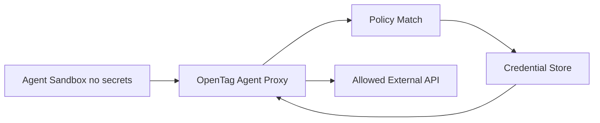

# 07. Access Control、安全与审计

## 1. 威胁模型

OpenTag 连接 Slack、代码仓库、工具 API 和可执行 Agent。风险高于普通 chatbot。

主要风险：

1. Prompt injection：Slack/thread/repo/网页内容诱导 Agent 越权。
2. Secret leakage：API key、GitHub token、Slack token 进入 prompt 或日志。
3. Confused deputy：低权限用户让高权限 Agent 执行动作。
4. Dangerous command：Agent 执行破坏性 shell。
5. Data exfiltration：Agent 把敏感信息发到外部 host。
6. Cross-channel leak：私有频道信息进入公开频道。
7. Cost runaway：长任务无限消耗 token。
8. Supply chain risk：第三方 runtime/plugin/MCP server 不可信。

## 2. Scope-based Access

OpenTag 权限必须跟 channel/scope 绑定，而不是跟提问用户的个人权限简单绑定。

### 2.1 Scope 层级

```text
org -> workspace -> channel -> thread
```

### 2.2 Access Bundle

Access Bundle 是一组能力：

- Connections：GitHub、Linear、Jira、Sentry、Datadog、Drive、内部 API。
- Repositories：允许访问的 repo。
- Tools：允许的工具动作。
- Instructions：团队规范。
- Policy：审批、限制、预算。

### 2.3 User Permission

即使 channel 有能力，也不是所有用户都能触发所有任务。

用户权限：

- `invoke`：可 @OpenTag。
- `approve_low_risk`：可批准低风险写操作。
- `approve_high_risk`：可批准高风险命令。
- `admin_channel`：可改频道配置。
- `admin_workspace`：可改 workspace 配置。

## 3. Policy Engine

### 3.1 Policy 输入

```json
{
  "actor": { "type": "slack_user", "id": "U123" },
  "scope": { "workspace": "T1", "channel": "C1" },
  "action": "github.pull_request.create",
  "resource": "github:org/repo",
  "risk": "medium",
  "runtime": "claude-code",
  "session_id": "sess_123"
}
```

### 3.2 Policy 输出

```json
{
  "decision": "require_approval",
  "reason": "Creating a pull request writes to GitHub",
  "approvers": ["channel_admin", "repo_owner"],
  "expires_in_seconds": 900
}
```

### 3.3 动作等级

| 等级 | 示例 | 默认策略 |
|---|---|---|
| read_low | 读 thread、读公开 repo 文件 | allow |
| read_sensitive | 读私有 repo、读 Sentry issue | allow if bundle permits |
| write_low | 创建草稿文档、创建 issue | approval optional |
| write_medium | push branch、open PR | require approval |
| write_high | merge PR、部署、改数据库 | deny 或 require admin approval |
| destructive | 删除数据、rotate secrets、prod deploy | deny by default |

## 4. Secrets 处理

### 4.1 MVP 最低要求

- `.env` 不进入 prompt。
- runtime env 只注入必要变量。
- 日志 redaction：`xoxb-`、`ghp_`、`sk-` 等模式。
- Slack/DB 中不保存明文 secret。
- 用 secret manager 或 encrypted column。

### 4.2 生产目标：Credential Proxy

目标：Agent sandbox 中没有明文 key。



规则：

- 出站请求必须经过 proxy。
- 请求匹配 host/path/method 规则才注入 credential。
- 不匹配则 block。
- credential 不返回给 sandbox。
- response 可 redaction。

## 5. 网络控制

MVP：

- Docker network 限制。
- deny known metadata endpoints：`169.254.169.254`。
- allowlist 常用 host：github.com、api.github.com、slack.com。

生产：

- default-deny egress。
- 每个 access bundle 有 allowed domains。
- 所有 outbound 经过 proxy。
- DNS logging。

## 6. 文件系统控制

- workspace 目录隔离。
- 禁止访问 host `$HOME`。
- 禁止 mount SSH key、cloud credentials。
- repo checkout 使用短期 token。
- 输出 artifact 目录单独管理。

危险路径 denylist：

```yaml
filesystem_deny:
  - ~/.ssh
  - ~/.aws
  - ~/.config/gcloud
  - '**/.env'
  - '**/id_rsa'
  - /etc/passwd
```

## 7. Shell 命令控制

### 7.1 MVP 命令策略

允许：

- `git status`, `git diff`, `git log`
- `npm test`, `pnpm test`, `pytest`
- `grep`, `rg`, `sed`, `cat` within workspace

审批：

- `git push`
- package install
- migration generation

禁止：

- `rm -rf /`
- `curl ... | sh`
- `chmod 777 -R`
- `sudo`
- cloud CLIs touching prod

### 7.2 命令解析

不要只做字符串包含。使用 shell parser 或最少做：

- command binary 提取。
- 参数 deny pattern。
- cwd 限制。
- env 限制。

## 8. 审计日志

必须不可篡改或至少 append-only。

记录：

- event received。
- session created。
- context sources。
- policy decisions。
- tool calls。
- shell commands。
- external API calls。
- approvals。
- artifacts。
- memory writes。
- final result。

审计表：

```sql
create table audit_events (
  id text primary key,
  org_id text not null,
  session_id text not null,
  event_type text not null,
  actor_type text,
  actor_id text,
  action text,
  resource text,
  decision text,
  payload jsonb,
  redacted_payload jsonb,
  created_at timestamptz not null default now()
);
```

后续增强：

- hash chain。
- signature。
- export to SIEM。
- admin audit dashboard。

## 9. Budget / Usage Guard

预算层级：

- org monthly。
- workspace monthly。
- channel monthly。
- session max。
- user daily。

当达到限制：

- 新 session 拒绝。
- running session 暂停。
- Slack 中提示需要 admin 提高预算。

## 10. Human-in-the-loop

审批 UX 必须简单：

- Slack button approve/deny。
- 显示动作、资源、风险、影响。
- 审批过期。
- 审批只能由有权限的人点。
- 审批结果进 audit。

## 11. MVP 安全清单

- [ ] Slack signature verification。
- [ ] Event idempotency。
- [ ] Workspace/channel allowlist。
- [ ] Runtime cwd 限制。
- [ ] Secrets redaction。
- [ ] Dangerous command denylist。
- [ ] Write action approval。
- [ ] Audit log。
- [ ] Session timeout。
- [ ] Cost limit。
- [ ] Bot self-message filter。
- [ ] Admin-only config changes。
