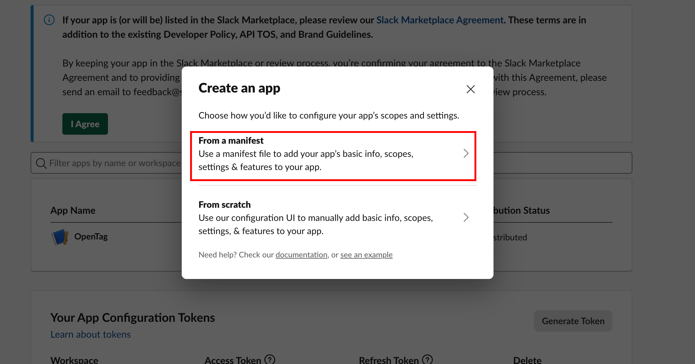
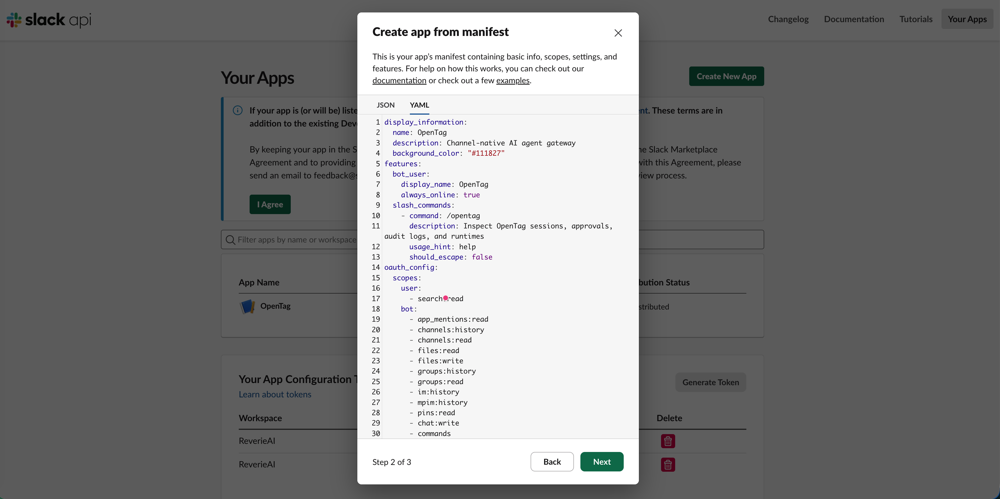
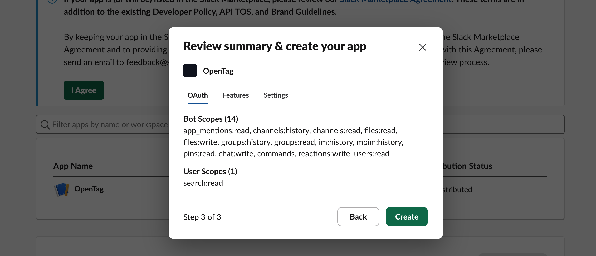
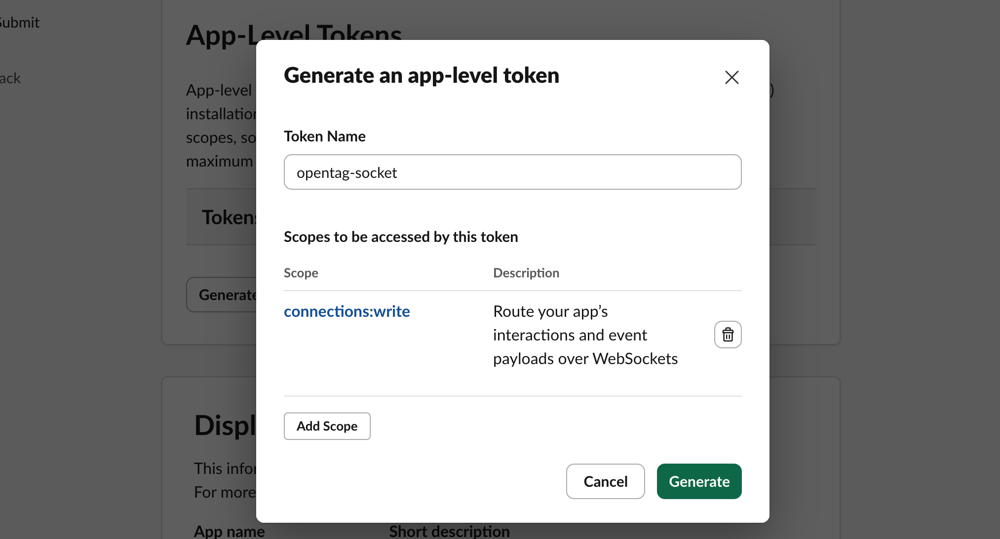
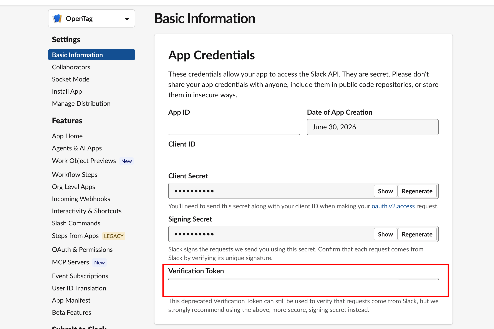
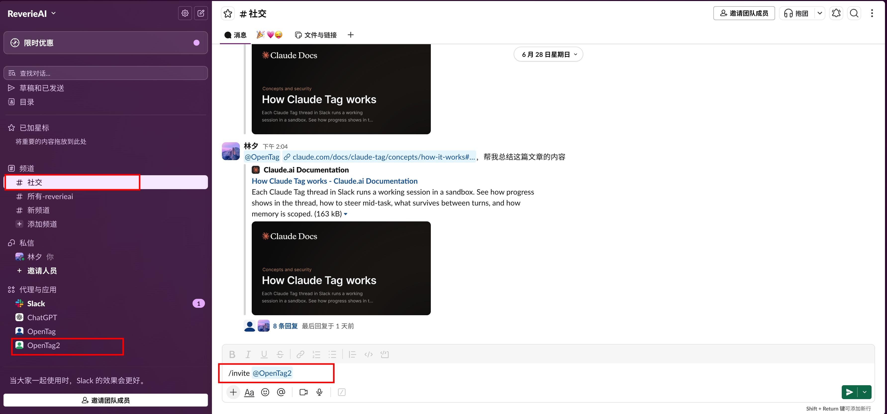

# 安装 OpenTag

[English](./01-install.md) · 简体中文

本指南会把 OpenTag 安装成本地运行、连接 Slack 的 daemon。

## 要求

- Node.js `20.11.0` 或更新版本。
- npm。
- 一个你可以创建或安装 App 的 Slack workspace。
- 如果要真实执行 Agent，需要本地 Agent runtime：
  - `codex` 用于 Codex。
  - `opencode` 用于 OpenCode。
  - `openclaw` 用于 OpenClaw。
  - `hermes` 用于 Hermes。
- 如果绑定的项目是 Git 仓库，需要安装 Git。

你可以使用 `mock` 在没有真实 runtime 的情况下测试 OpenTag。

## 安装 CLI

在 OpenTag 仓库中运行：

```bash
npm install
npm link
```

确认 CLI 可用：

```bash
opentag help
```

## 运行本地设置

把 OpenTag 绑定到当前项目并选择 runtime：

```bash
opentag init --project . --runtime codex --open-slack
```

也可以选择其他 runtime：

```bash
opentag init --project . --runtime opencode --open-slack
opentag init --project . --runtime mock --open-slack
```

设置流程会写入：

```text
~/.opentag/config.json
~/.opentag/slack-app-manifest.yml
~/.opentag/.env
~/.opentag/.env.example
项目目录中的 .opentag/project.json
```

它还会把生成的 Slack manifest 复制到：

```text
examples/slack-app-manifest.generated.yml
```

## 创建 Slack App

打开 Slack App 创建页面：

```bash
opentag slack open
```

在 Slack 页面里选择 **Create from manifest**。

<p align="center">
  
</p>

选择从 manifest 创建 App，并导入：

```text
~/.opentag/slack-app-manifest.yml
```

Slack 后台不能直接读取本地文件时，把该文件内容复制到 manifest 输入框中。

<p align="center">
  
</p>

生成的 manifest 已配置为 Socket Mode，所以本地使用不需要公网 webhook URL。

确认 manifest 后，把 App 安装到目标 workspace。

<p align="center">
  
</p>

## 创建 Slack Tokens

OpenTag 需要：

```text
SLACK_BOT_TOKEN=xoxb-...
SLACK_APP_TOKEN=xapp-...
SLACK_SIGNING_SECRET=...
# 可选，仅用于 Slack 原生 workspace search：
SLACK_USER_TOKEN=xoxp-...
```

编辑生成的 env 文件：

```bash
$EDITOR ~/.opentag/.env
```

`SLACK_APP_TOKEN` 必须是带有 `connections:write` scope 的 app-level token。
`SLACK_USER_TOKEN` 是可选的；只有在启用 Slack 原生 workspace search，并设置 `workspaceSearch.slackSearchEnabled=true` 时才需要。

### 获取 `SLACK_APP_TOKEN`

路径：

```text
Slack App 页面
-> Basic Information
-> App-Level Tokens
-> Generate Token and Scopes
```

填写：

```text
Token Name: opentag-socket
Scope: connections:write
```

<p align="center">
  
</p>

生成后复制 `xapp-...` 到：

```bash
SLACK_APP_TOKEN=xapp-...
```

### 获取 `SLACK_BOT_TOKEN`

路径：

```text
Slack App 页面
-> OAuth & Permissions
-> Install to Workspace
-> Allow
-> Bot User OAuth Token
```

复制 `xoxb-...` 到：

```bash
SLACK_BOT_TOKEN=xoxb-...
```

### 获取 `SLACK_SIGNING_SECRET`

路径：

```text
Slack App 页面
-> Basic Information
-> App Credentials
-> Signing Secret
```

<p align="center">
  
</p>

复制 signing secret 到：

```bash
SLACK_SIGNING_SECRET=...
```

不要使用截图里的 Verification Token。OpenTag 需要的是 Signing Secret。

## 检查安装

运行：

```bash
opentag doctor --strict
```

如果还没有填写 Slack tokens，可以只检查本地配置和 runtime 可用性：

```bash
opentag doctor --strict --offline
```

脚本、本地 UI 或 issue report 可以使用结构化输出：

```bash
opentag doctor --strict --offline --json
```

当检查失败时，`opentag doctor` 会输出一个简短的 `Next actions` 列表，告诉你应该优先修复哪些文件或命令。

随时查看当前最短设置清单：

```bash
opentag next
```

也可以验证 Slack bot token：

```bash
opentag slack test
```

## 启动 OpenTag

启动本地 daemon：

```bash
opentag daemon start
```

查看状态：

```bash
opentag daemon status
```

读取日志：

```bash
opentag daemon logs
```

停止 daemon：

```bash
opentag daemon stop
```

## 邀请 Bot 进入频道

安装完成后，在 Slack workspace 中找到你创建的 OpenTag App，然后把它加入目标频道。

<p align="center">
  
</p>

在频道中输入：

```text
/invite @OpenTag
```

如果你的 Slack App 名不是 `OpenTag`，请使用你创建 App 时设置的 bot 名。

## 保持 Daemon 运行

macOS：

```bash
opentag daemon install
launchctl load ~/Library/LaunchAgents/com.opentag.daemon.plist
```

Linux：

```bash
opentag daemon install
systemctl --user enable --now opentag.service
```
